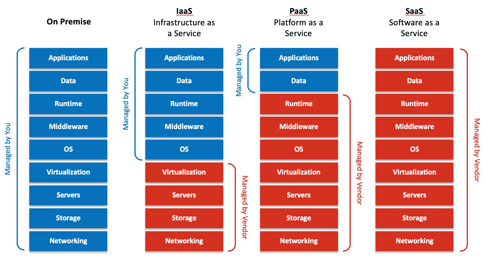

# 1.1 클라우드 컴퓨팅

## 1.1.1 클라우드 컴퓨팅이란

### 온프레미스(on-premises)

- IT 자원을 구축하는 전통적인 방법.
- 프레미스(premise)는 기본, 건물, 토지라는 뜻이므로, 온프레미스는 **자체적인 공간과 자원을 이용하여 사용자가 직접 구축 및 운영하는 방식**을 의미한다.
- 단점 : 사용자 구축 부담 및 비용 증가

### 온디맨드(on-demand)

- 클라우드 컴퓨팅은 인터넷을 통해 요구가 있을 때 즉시 IT 자원을 제공하며, 사용한 만큼 비용을 지불하는 서비스.
- 인터넷 구간 어딘가에 구름 형태로 쌓여 실제 물리적인 자원은 보이지 않지만 IT자원을 원하는 대로 가져다 사용할 수 있다.
- AWS(Amazon Web Service)와 같은 클라우드 공급자에게 필요에 따라 다양한 IT자원을 공급받을 수 있다.

> 💡 온프레미스와 클라우드 정의
>
> - 온프레미스(on-premises) : 사용자 입장에서 공간, 자원 등 모든 것을 자체적으로 구축 및 운영하는 방식
> - 클라우드(cloud) : 인터넷 구간 어딘가에 눈에 보이지 않는 형태로 구성된 IT 자원 집합.
> - 클라우드 컴퓨팅(cloud computing): 인터넷을 통해 IT 자원 요규에 따라 사용한 만큼 비용을 지불하는 서비스.

 

## 1.1.2 클라우드 컴퓨팅 이점

### 민첩성

- 클라우드를 통해 광범위한 기술에 쉽게 접근 가능하여 필요한 자원을 빠르게 구동할 수 있다.

### 탄력성

- 온프레미스 환경과 달리, 향후 비즈니스 확장을 고려한 IT자원을 사전에 과하게 구성할 필요가 없다.
- 비즈니스 요구가 가변적인 상황에서 자원을 손쉽게 확장하거나 축소하여 탄력적으로 운영할 수 있다.

## 비용 절감

- 클라우드 컴퓨팅은 PAy Per Use로, IT 자원을 상용한 만큼 비용을 지불하면 된다.

 

## 1.1.3 클라우드 컴퓨팅 서비스 유형

- 최근 IT영역에서 사용하는 **서비스형(as-a-service)**라는 단어에서 여러 분야의 서비스 유형을 분류하는 용어가 많이 파생되고 있다.
- 클라우드 사용자가 어느 영역까지 관리하는지, 반대로 클라우드 공금자가 어느 영역까지 관리하는지에 따라 유형을 분류한다.

 
  
<em> > 출처 : https://hazelcast.com/foundations/software-architecture/infrastructure-as-a-service-iaas/</em>

  

### IaaS(Infrastructure as a Service)

- **인프라에 대한 클라우드 서비스 유형** 을 의미한다.
- `서버`, `네트워크`, `스토리지` 등 **하드웨어 영역과 가상화 기능**이 해당 된다.
- 클라우드 공급자는 해당 인프라 영역을 관리하고 서비스를 제공하며, 클라우드 사용자가 나머지 영역을 직접 관리한다.

### PaaS(Platform as a Service)

- 플랫폼 형태로 제공되는 클라우드 서비스 유형을 의미한다.
- 클라우드 공급자가 자체적으로 구축한 플랫폼을 제공한다.
- 클라우드 사용자는 별도의 플랫폼을 구축하지 않고 애플리케이션을 개발 및 관리만 한다.
- 즉, 클라우드 사용자는 애플리케이션 영역만 담당하고 나머지는 클라우드 공급자가 관리 및 제공하는 구조다.

## SaaS(Software as a Service)

- 소프트웨어 영역까지 클라우드 공급자가 관리 및 제공하는 유형을 의미한다.
- 클라우드 사용자는 별도의 애플리케이션을 설치 없이 클라우드 서비스를 제공 받을 수 있다.
- 클라우드 공급자가 모든 것을 제공하고 클라우드 사용자는 서비스만 받은 구조다.

 

> 💡 클라우드 서비스 유형
>
> - IaaS: 서버, 네트워크, 스토리지 등 하드웨어 자원을 클라우드 공급자가 제공하는 클라우드 서비스 유형.
> - PaaS: 플랫폼 영역까지 클라우드 공급자가 제공하며, 사용자는 애플리케이션 영역만 관여하는 클라우드 서비스 유형.
> - SaaS: 애플리케이션 영역까지 모든 영역을 클라우드 공금자가 제공하는 클라우드 서비스 유형.

 

## 1.1.4 클라우드 구축 모델

### 퍼블릭 클라우드(public cloud) 구축 모델

- 서비스의 주체가 '클라우드 공급자'이다.
- 대표적인 퍼블릭 클아우드 공급자에는 `AWS`, `GCP`, `Azure`등이 있다.
- 온디맨드 형태로 사용자 요구에 따라 클라우드 공급자에게서 IT 자원을 할당받아 확장성이 우수하다.
- 여러 국가의 지역에 데이터 센터를 보유하고 있어 글로벌 서비스 제공에 유리하다.
  > 마치 도서관 같은 것 => 여러 사람이 함게 쓰는 컴퓨터방

### 프라이빗 클라우드(private cloud) 구축 모델

- 서비스의 주체가 '사용자'이다.
- 자원 소유권은 사용자한테 있고, **프라이빗 클라우드는 온프레미스 환경에 구축되어 서비스를 받는 환경**이다.
- 온프레미스 환경에 구축되어 보안이 우수하지만, 퍼블릭 클라우드보다 서비스 확장성은 떨어진다.
  > 개인용 클라우드, 나만 쓰는 컴퓨터방

### 하이브리드 클라우드(hybrid cloud) 구축 모델

- 퍼블릭 클라우드와 프라이빗 클라우드의 단점을 보완하려고 등장한 클라우드 모델.
- 다수의 클라우드 시스템이 혼합되어 있는 형태로, 클라우드 시스템이 서로 연결된 모델이다.
  > 예를 들어, 집에서도 공부하고, 도서관에서도 공부하는 것과 같음.

 
 

# 1.2 AWS 서비스

## 1.2.1 AWS 소개

- AWS는 `Amazon` 자회사.
- 다양한 퍼블릭 클라우드 컴퓨팅 서비스를 제공하고 있다.
- 26개의 리전과 84개의 가용 영역을 운영하며, 글로벌 클라우드 인프라를 제공한다.(2022년 8월 기준)

 
  
<em> > 출처 : https://velog.io/@ymh92730/AWS-Global-Infrastructure</em>

  

 
  > 💡 **리전과 가용 영역**  
  > 리전(region): 데이터 센터가 집합된 물리적 위치(지역)  
  > 가용 영역(availability zone): 리전 내 구성된 하나 이상의 개별 데이터 센터

 

## 1.2.2 AWS 서비스 라인업

- AWS는 컴퓨팅, 스토리지, 데이터베이스 등 인프라 서비스부터 사물 인터넷, 머신 러닝, 빅데이터 분석까지 클라우드 기반의 다양한 서비스가 존재한다.
- 궁극적으로 구성하고자 하는 클라우드 기반의 웹 서비스에 필요한 `컴퓨팅`, `네트워킹`, `스토리지`, `데이터베이스`, `보안 자격`을 간략히 알아본다.

### AWS 컴퓨팅

- 퍼블릭 클라우드의 서버 자원에 대해 가성 머신을 생성하고, 비용 및 용량을 관리할 수 있는 서비스들로 구성되어 있다.
- 대표적으로 `EC2(Elastic Compute Cloud)`가 있으며, EC2 서비스 덕분에 클라우드에서 안전하고 가변성이 보장되는 컴퓨팅 자원을 제공받을 수 있다.

### AWS 네트워킹 및 콘텐츠 전송

- 퍼블릭 클라우드에 생성한 다양한 자원으로 **내/외부 통신을 하는 네트워크 서비스**들로 구성되어 있다.
- `VPC(Virtual Private Cloud)`, `CloudFront`, `Route53`
- 생성된 클라우드 자원의 통신 환경을 구성할 수 있다.

### AWS 스토리지

- 퍼블릭 클라우드에 안정적으로 확장성이 높은 스토리지 서비스들로 구성되어 있다.
- `S3(Simple Storage Service)`, `EFS(Elastic File System)`
- 클라우드에서 빠르고 안정적으로 데이터를 저장할 수 있다.

### AWS 데이터베이스

- 목적과 용도에 따라 퍼블릭 클라우드에 **다양한 데이터베이스 엔진을 제공**하여 **완전 관리형 데이터베이스 서비스**를 하고 있다.
- `RDS(Relational Database Service)`, `Aurora`, `DynamoDB`
- 데이터베이스 유형에 따라 선택해서 사용할 수 있다.

### AWs 보안 자격 증명 및 규격 준수

- 퍼블릭 클라우드 `자원과 사용자 자격 증명 및 접근 관리`, `데이터/네트워크/애플리케이션 보호와 위협 탐지` 및 모니터링을 위한 다양한 서비스로 구성되어 있다.
- `IAM(Identity & Access Management)` : 서비스 및 자원에 대한 안전한 접근 관리를 제공한다.

 

## 1.2.3 AWS 과금 체계

- IT 자원을 사용한 만큼 비용을 지불하는 형태.
- 클라우드 서비스를 도입하기에 앞서 비용 검토가 선행되어야 하고 필요 자원을 사정해야 한다.
- 항상 과금은 시간과 사용량에 비례하여 사용한 만큼 부여한다는 점을 유의하자!
- `프리티어(free-tier)` 플랜 : 처음으로 회원 가입을 한 경우 12개월간 일정 수준의 시간과 용량까지 무료로 사용할 수 있는 과금 정책.
- 자세한 프리티어 관련 정책 [여기](https://aws.amazon.com/ko/free)를 참고하면 된다.

 
 

# 1.3 AWS 가입하기 - 프리티어

## 1.3.2 AWS 관리 콘솔 둘러보기

### AWS 클라우드 컴퓨팅 서비스의 자원을 관리하는 방법

1. AWS 관리 콘솔(management console)을 이용하는 방법
   - 웹 기반으로 손쉽게 AWS 클라우드 자원을 관리할 수 있다.
2. AWS CLI(Command Lin Interface)을 이용하는 방법
   - 셸 프로그램을 사용한 명령어 기반으로 AWS 클라우드 자원을 관리할 수 있다.
3. AWS IaC(Infrastructure as Code)를 이용하는 방법
   - 코드 기반으로 AWS 클라우드 자원을 관리할 수 있다.
