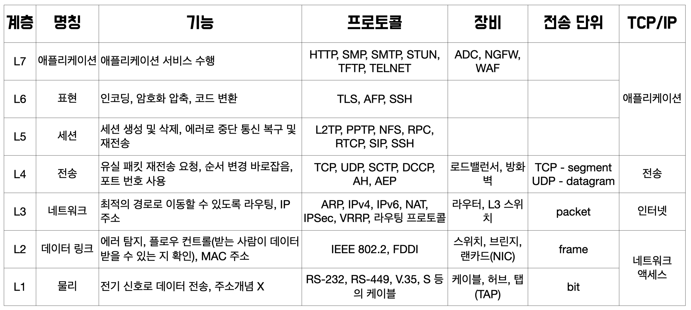

# 3.1 네트워킹이란

## 3.1.1 네트워킹 정의

- `네트워킹(networking)`은 '서로 연결한다'는 뜻으로 서로 간의 의사소통을 하는 환경이다.
- 실제 네트워킹을 수행한다는 것은 굉장히 다양한 요소가 유기적으로 연결되고 복잡한 과정을 거치는 것이다.

## 3.1.2 네트워킹 요소

 
  
<em> > 출처 : https://velog.io/@skyepodium/OSI-7-%EA%B3%84%EC%B8%B5-%EC%95%8C%EC%95%84%EB%B3%B4%EA%B8%B0</em>

  

- `1계층 - 물리 계층` :
  - 네트워크 하드웨어 전송 기술을 이루는 계층.
  - 물리적으로 연결된 매체가 서로 데이터를 송수진할 수 있게 연결하고 유지하는 역할.
- `2계층 - 데이터링크 계층` :
  - 물리 계층에서 송수신되는 정보의 오류와 흐름을 제어.
- `3계층 - 네트워크 계층` :
  - 데이터를 목적지까지 전달하는 계층
  - 최적의 통신 경로 탐색.
- `4계층 - 전송 계층` :
  - 종단의 대상 간 데이너 전송을 다루는 계층
  - 데이터 전송의 유효성과 효율성을 보장.
- `5계층 - 세션 계층` :
  - 종단의 대상 간 응용 프로세스 통신을 관리하는 방법
  - 데이터 통신을 위한 논리적인 연결 담당.
- `6계층 - 표현 계층` :
  - 데이터 형식에 차이가 있을 때 데이터를 서로 이해할 수 있는 형태로 변환하는 역할.
- `7계층 - 응용 계층` :
  - 응용 프로세스와 직접 연계하여 실제 응용 프로그램을 서비스하는 역할.

### IP 주소

- IP(Internet Protocol) 주소는 인터넷상에서 IT 자원을 식별하는 고유한 주소다.
- 일반적으로 `IPv4`를 더 많이 사용한다.
- `IPv4` : 10진수(0~255) 또는 2진수(0~1) 네 자리로 되어 있으며, 각 자리는 온점(.)으로 구분해서 표현한다.

> 💡 IPv4는 가용 범위가 부족하고 효율성이 떨어진다는 단점이 있다.
> 이를 개선하고자 IPv6를 개발했으며 IPv4의 가용 범위가 부족한것을 보완하고자 여러 네트워킹 기법(NAT, 서브넷팅, 프라이빗 IP 등)을 활용하고 있다.

### 퍼블릭 IP 주소와 프라이빗 IP 주소

- 통신 용도에 따라.
- `퍼블릭 IP 주소` : 실제 인터넷에서 사용하려고 인터넷 서비스 공급자(ISP)에서 제공하는 유일한 `공인 IP` 주소.
- `프라이빗 IP 주소` : 인터넷이 아닌 독립된 네트워크 내부에서만 사용하려고 네트워크 관리자가 제공하는 `사설 IP` 주소.

> 💡 **프라이빗 IP 주소 3가지 클래스 범위**
>
> - 클래스 A : 10.0.0.0 ~ 10.255.255.255
> - 클래스 B : 172.16.0.0 ~ 172.31.255.255
> - 클래스 C : 192.168.0.0 ~ 192.168.255.255

### 고정 IP 주소와 유동 IP 주소

- 할당 방식에 따라.
- `고정 IP 주소` : 네트워크 관리자가 수동으로 할당하는 방식.
- `유동 IP 주소` : 특정 서버가 IP 주소 범위에 따라 동적으로 할당하는 방식.
  - `DHCP(Dynamic Host Configuration Protocol)` 프로토콜을 통해 **주소를 제공하는 서버와 주소를 할당받는 클라이언트로 구성**
  - IP 주소를 임대하는 형태.

> 💡 **DHCP 프로토콜**
>
> - DHCP 서버와 DHCP 클라이언트 관계에 따라 동적으로 IP 주소 할달.
> - DHCP Discover : DHCP 클라이언트에서 DHCP 서버를 찾는 메세지
> - DHCP Offer : DHCP 서버에서 할당할 IP 주소와 임대 시간을 알리는 메세지
> - DHCP Request : DHCP 클라이언트에서 DHCP 서버로 할당받을 IP 주소를 요청하는 메세지
> - DHCP Ack : DHCP 서버에서 최종적으로 할다할 IP 주소 승인을 알리는 메세지

### 서브넷과 서브넷 마스크

- 주체와 목적에 따라 부분 네트워크로 나누고, 서로 연결하여 거대한 네트워크 환경을 이룬다.
- `서브넷(subnet)` : 부분 네트워크를 의미.
- `서브넷 마스크(subnet mask)` : 서브넷을 구분하고 식별하는 역할.
  - IP 주소와 동일한 32비트 구조에 네트워크 ID와 호스트 ID로 구성되어 있다.
  - `네트워크 ID` : 서브넷을 구분하는 기준값.
  - `호스트 ID` : 동일 서브넷 내에서 대상을 구분하는 기준값.
- 서브넷 마스크 표현 법
  - 10진수 4자리 : `255.255.255.0`
  - 2진수 32자리 : `11111111.11111111.11111111.00000000`
  - /네트워크 ID 비트 수 : `/24`
- `10.0.0.0/8`과 같은 형태로 표현하는 방식을 `IP CIDR(Classless Inter Domain Routing)` 표기법이라고 한다.

### 라우팅과 라우터

- 라우팅(routing) : 네트워킹 통신을 수행할 때 목적지 경로를 선택하는 작업.
- 라우터(router) : 라우팅을 수행하는 장비.
  - 라우팅 테이블이라는 서브넷의 경로 리스트를 가지고 **목적지 네트워크에 대한 최적 경로를 선택해서 전달**하는 역할.

### TCP와 UDP - 데이터 전송 담당

- `TCP(Transmission Contol Protocol)` :

  - 송수신 대상 간 연결을 맺고 데이터 전송 여부를 하나씩 확인하며 전송하는 `연결형 프로토콜`.
  - 신뢰성 있는 데이터 전송을 보장.
  - 단점 : 느린 속도
    |서비스/프로토콜| 포트 번호 |설명|
    |---|---|---|
    |HTTP | 80 |웹 서비스 (비암호화)|
    |HTTPS 443 |웹 서비스 (TLS/SSL 암호화)|
    |SSH | 22| 원격 접속 (보안 셸)|
    |FTP | 20/21| 파일 전송 프로토콜|
    |SMTP| 25, 587 |이메일 전송|
    |IMAP| 143, 993| 이메일 수신 (암호화 포함 가능)|
    |POP3| 110, 995 |이메일 수신 (단순 우체국 프로토콜)|
    |Telnet| 23 |원격 터미널 접속 (비보안)|
    |MySQL| 3306 |데이터베이스 서비스|
    |PostgreSQL| 5432| 데이터베이스 서비스|
    |RDP | 3389| 원격 데스크탑 연결|
    |LDAP| 389 (636)| 디렉터리 서비스 (636은 TLS)|

- `UDP(User Diagram Protocol)` :
  - 송수신 대상 간 연결 없이 전달하는 `비연결형 프로토콜`
  - 신뢰성 있는 전송을 보장할 수 없지만, 빠르게 데이터를 전송할 수 있다.
  - 데이터 유실에 큰 지장이 없고 빠른 데이터 전송을 위한 응용 서비스에 활용된다.
    |서비스/프로토콜| 포트 번호| 설명|
    |---|---|---|
    |DNS| 53| 도메인 이름 해석 (쿼리는 주로 UDP, 응답이 크면 TCP로 fallback)|
    |DHCP| 67/68| IP 주소 자동 할당|
    |TFTP| 69| 간단한 파일 전송 (비신뢰성)|
    |SNMP| 161/162| 네트워크 관리 프로토콜|
    |NTP| 123| 시간 동기화|
    |RADIUS| 1812/1813 |네트워크 인증 및 회계|
    |VoIP (예: SIP, RTP)| 5060/5061| 등 실시간 음성/영상 전송|
    |QUIC (HTTP/3)| 동적으로 할당됨| UDP 기반의 최신 전송 프로토콜|

### ✅ 정리 요약

| 구분      | TCP                  | UDP                         |
| --------- | -------------------- | --------------------------- |
| 연결 방식 | 연결지향             | 비연결지향                  |
| 신뢰성    | 보장됨 (재전송 등)   | 보장 안 됨                  |
| 속도      | 상대적으로 느림      | 빠름                        |
| 사용 예   | 웹, 메일, DB, SSH 등 | 스트리밍, VoIP, DNS, NTP 등 |

### 포트 번호

- TCP와 UDP는 서로 구분할 수 있도록 포트 번호를 사용한다.
- `IANA(Internet Assigned Numbers Authority)`라는 인터넷 할당 번호 관리 기관에서 정의.
  > 💡 IANA에서 정의하는 포트 번호 범위
  >
  > - 잘 알려진 포트 번호 (well-known port) : 0~1023
  > - 등록된 포트 번호 (registered port) : 1024~49151
  > - 동적 포트(dynamic port) : 49152~65535

 

# 3.2 AWS 네트워킹 소개

## 3.2.1 AWS 리전 네트워킹 디자인

- `리전` : 전 세계 주요 도시의 데이터 센터를 군집화(clustering)하는 물리적인 위치를 의미.
- AWS 리전 내부에는 `트랜짓 센터`와 `가용 영역`이 서로 연결되어 네트워크 환경을 이루고 있다.

### Intra-AZ 연결

- 리전 내부에는 논리적인 데이터 센터의 집합인 가용 영역이 여럿 존재한다.
- 가용 영역에 존재하는 데이터 센터들은 고밀도 광섬유 케이블을 사용하여 100GE 또는 400GE로 상호 연결되어 네트워킹 환경을 구성한다.
- 데이터 센터 간 연결을 `Intra-AZ 연결`이라고 한다.

### Inter-AZ 연결

- 지리적으로 떨어져 있는 가용 영역끼리 연결되어 네트워킹 환경을 구성하고 있다.
- 가용 영역 간 연결을 `Inter-AZ 연결`이라고 한다.

### 트랜짓 센터 연결

- **리전에서 외부 인터넷 구간과 통신이 필요할 경우** 사용.
- 내부에 있는 가용 영역들은 외부 인터넷 통신을 위해 트랜짓 센터와 연결되어 네트워킹 환경을 구성한다.
- 가용 영역 간 연결을 `트랜짓 센터 연결(transit center connection)`이라고 한다.

## 3.2.2 AWS 글로벌 네트워크와 엣지 POP

- `엣지 POP(edge Point Of Presence)` : AWS 글로벌 네트워크 전용망을 활용하여 안정적으로 고성능 서비스를 제공하는 센터.
- 사용자에게 글로벌 서비스 콘텐츠를 빠르게 제공할 수 있다.
- `엣지 로케이션(edge location)`과 `리전별 엣지 캐시(regional edge cache)`로 구성되어 있다.
- 대표적으로 Amazon CloudFront, Amazon Route 53, AWS Shield, AWS Global Accelerator 등이 있다.
- 엣지 POP가 속해 있는 AWS 백본 네트워크는 AWS 글로벌 네트워크와 연결되어 있으며, 모든 리전(중국 제외)은 백본 네트워크를 중심으로 서로 연결되어 있다.

> 💡 백본 네트워크(backbone)
>
> - 다양한 지역의 네트워크(예: 도시, 국가 등)를 서로 연결해주는 핵심 네트워크.
> - 우리가 흔히 쓰는 인터넷이 동네 도로라면, 백본 네트워크는 고속도로나 지하철 본선처럼 중심 역할을 하는 망.

# ❓"일반적인 서비스"와 "엣지 POP (Point of Presence)"를 활용한 서비스의 차이점

## 🧭 개념 간단 정리

| 구분                 | 설명                                                                           |
| -------------------- | ------------------------------------------------------------------------------ |
| 일반적인 서비스      | AWS 리전 내 VPC나 서비스가 인터넷(예: 사용자 브라우저)에 직접 연결됨           |
| 엣지 POP 활용 서비스 | CloudFront, Route 53, Global Accelerator 등 엣지 POP에서 처리 후 백엔드와 통신 |

## 🧱 구성 비교

### 1. 일반적인 AWS 서비스 (예: EC2, ALB, S3 웹 호스팅 등)

- 사용자가 인터넷을 통해 AWS 리전으로 직접 접근
  - 예: 사용자가 브라우저에서 EC2 인스턴스(웹서버)에 접근
- 데이터 흐름:  
  `사용자 → 인터넷 → AWS 리전(ALB/EC2 등)`

- **특징:**
  - 인터넷 경로는 공용 ISP를 거치므로 지연/불안정 가능성 있음
  - 리전에 가까운 사용자에겐 빠르지만, 먼 지역에선 느림
  - 보통 VPC의 NAT Gateway 또는 IGW(Internet Gateway)를 통해 통신

### 2. 엣지 POP 활용 서비스 (예: CloudFront, Route 53, Global Accelerator)

- 사용자의 요청은 가장 가까운 **엣지 POP(Edge Location)**에 도달

- 엣지 POP에서 캐싱/라우팅/최적화 처리 후 AWS 백본으로 전송

- 데이터 흐름:  
  `사용자 → 엣지 POP → AWS 백본 → 리전 서비스(EC2/S3 등)`

- 특징:

  - 전 세계 수백 개 엣지 POP로, 사용자와 물리적 거리를 최소화  
    CloudFront는 콘텐츠 캐싱,  
    Route 53은 지능형 DNS,  
    Global Accelerator는 TCP/UDP 가속

- 이후 AWS 전용 백본을 통해 리전 서비스와 통신 → 빠르고 안정적

## 🔍 차이점 요약 표

| 항목                 | 일반                                  | 인터넷 경로                              | 엣지 POP 경유 |
| -------------------- | ------------------------------------- | ---------------------------------------- | ------------- |
| 사용자 경로          | ISP 통해 AWS 리전 직접 도달           | 가까운 엣지 POP 도달 후 AWS 백본 이용    |
| 성능                 | 지역에 따라 느리거나 불안정할 수 있음 | 전 세계적으로 빠르고 안정적              |
| 보안                 | 인터넷 경로 노출                      | AWS 백본 내 전송, 더 안전                |
| 활용 서비스          | EC2, S3 웹호스팅, ALB, NAT Gateway 등 | CloudFront, Route 53, Global Accelerator |
| 콘텐츠 캐싱          | 불가                                  | CloudFront 등으로 가능                   |
| 지능형 트래픽 라우팅 | 제한적                                | Route 53 + Global Accelerator로 가능     |

## 💡 예시로 이해해보기

예 1: CloudFront vs ALB  
CloudFront 사용 시:  
사용자는 서울에 있지만, 미국에 있는 S3에서 호스팅 중인 웹사이트에 접속  
→ 서울 POP에서 콘텐츠 캐싱하거나, 빠르게 AWS 백본을 통해 미국으로 연결

ALB만 사용하는 경우:  
서울 사용자 → 인터넷 통해 직접 미국 리전의 ALB 접속  
→ 더 높은 지연, 불안정 가능성

## ✅ 결론

| 선택 기준                           | 추천 경로                      |
| ----------------------------------- | ------------------------------ |
| 글로벌 사용자 대상 고성능 웹 서비스 | 엣지 POP 활용 (CloudFront 등)  |
| 내부 서비스, 리전 근처 사용자       | 일반 인터넷 경로 (ALB, EC2 등) |
| 낮은 지연, 고가용성 TCP 서비스      | Global Accelerator             |
| DNS 기반 지역 분산 처리             | Route 53                       |

 

## 3.2.3 AWS 네트워킹 서비스 소개

- 네트워크 기반
  - `VPC` : 클라우드 환경에서 가상의 프라이빗 네트워크
  - `Transit Gateway` : VPC와 온프레미스를 연결하는 단일 게이트웨이
- 엣지 네트워킹
  - `Route 53` : 확장 가능한 관리형 DNS 서비스
  - `Global Accelerator` : AWS 글로벌 네트워크를 활용한 애플리케이션 가용성 및 성능 개선
- 하이브리드 연결
  - `Direct Connect` : 온프레미스 환경과 연결하는 AWS 전용 네트워크
  - `Site-to-Site VPN` : 온프레미스 환경과 연결하는 암호화된 네트워크

# 3.3 Amazon VPC 소개

- `Amazon VPC(Virtual Private Cloud)`는 사용자 정의로 구성된 가상의 프라이빗 클라우드 네트워크다.

## 3.3.1 Amazon VPC 기본 구성 요소

### 리전과 VPC

- VPC는 리전마다 독립적으로 구성되어 있다.
- 예 : 서울 리전 VPC를 생성 했다면 생성한 VPC는 서울 리전에만 있다.
  > 💡 독립적으로 구성된 VPC는 필요에 따라 동일 리전이나 다른 리전에 위치한 VPC들을 서로 연결하여 클라우드 네트워크를 확장할 수도 있다.

### 서브넷과 가용 영역

- VPC라는 하나의 독립된 클라우드 네트워크에서도 서브넷을 이용하여 분리된 네트워크로 구성할 수 있다.
- 서브넷은 VPC 내 별도로 나누어진 네트워크라고 생각하면된다.
- 서브넷은 반드시 하나의 가용 영역에 종속적으로 위치한다.

- `퍼블릭 서브넷` : 인터넷 구간과 연결되어 있어 외부 인터넷 통신이 가능한 네트워크 영역.
- `프라이빗 서브넷` : 인터넷 구간과 연결되지 않은 폐쇄적인 네트워크 영역.

### IP CIDR

- 네트워크에 할당할 수 있는 IP 주소 범위를 표현하는 방법.
- VPC는 내부에 생성할 서브넷의 IP 주소 범위를 할당하기 위해 IP CIDR을 가지고 있다.
- VPC라는 큰 네트워크의 IP CIDR에서 서브넷이라는 작은 네트워크의 IP CIDR이 분할되어 있다.
- 결론적으로, 서브넷에 생성되는 자원은 IP CIDR 범위 안에 있는 IP 주소를 할당받을 수 있다.

### 가상 라우터와 라우팅 테이블

- VPC를 생성하면 기본적으로 네트워크 경로를 확인하여 트래픽을 전달하는 목적의 가상 라우터가 생성된다.
- 가상 라우터는 기본 라우팅 테이블을 보유하고 있으며, 라우팅 테이블을 통해 네트워크 경로를 식별할 수 있다.
- 생성된 라우팅 테이블은 서브넷과 연결하여 서브넷마다 라우팅 테이블을 가질 수도 있다.
